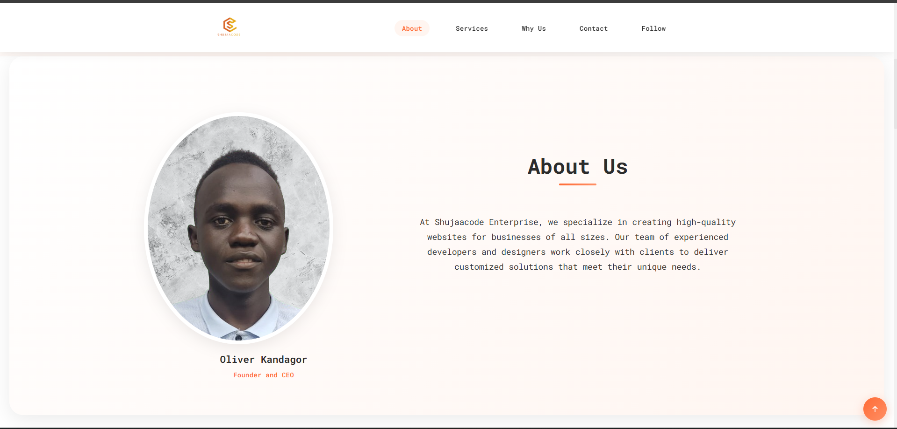
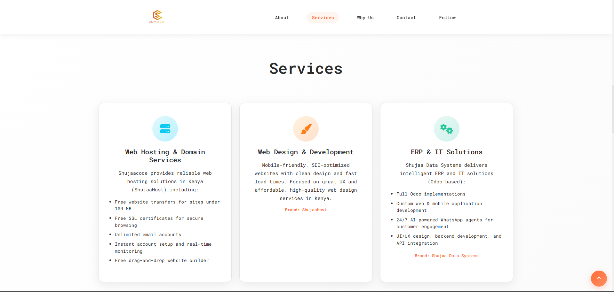

# 🏢 TechCorp Solutions - Professional Business Website

A comprehensive, responsive business website built with modern HTML5, CSS3, and JavaScript. This project showcases professional web development practices with clean code, responsive design, and interactive user experience.

## 📋 Table of Contents
- [Project Overview](#project-overview)
- [Screenshots](#screenshots)
- [File Structure](#file-structure)
- [Technologies Used](#technologies-used)
- [Features](#features)
- [CSS Architecture](#css-architecture)
- [JavaScript Functionality](#javascript-functionality)
- [Responsive Design](#responsive-design)
- [Installation & Setup](#installation--setup)
- [Deployment](#deployment)
- [Browser Compatibility](#browser-compatibility)
- [Performance Optimization](#performance-optimization)

## 🎯 Project Overview

**Purpose:** Professional business website for TechCorp Solutions showcasing company services, team, and contact information.

**Target Audience:** Potential clients seeking technology solutions and consulting services.

**Key Goals:**
- Professional brand presentation
- Mobile-first responsive design
- Fast loading performance
- Accessible user experience
- Contact form integration

## 📸 Screenshots

### Desktop Views

#### Homepage & Navigation

*Professional homepage with Shujaacode Enterprise branding and clean navigation*

#### About Us Section

*About Us section featuring Oliver Kandagor (Founder and CEO) with professional profile image and company description*

#### Services Showcase

*Three main service offerings: Web Hosting & Domain Services, Web Design & Development, and ERP & IT Solutions*

#### Contact Section

*Professional contact form with phone and email information, featuring clean input fields and submit button*

#### Why Choose Us

*Comprehensive list of company value propositions and service differentiators*

### Live Demo Features Shown
- ✅ **Responsive Navigation**: Clean header with logo and menu items
- ✅ **Professional Branding**: Consistent Shujaacode Enterprise branding
- ✅ **Service Portfolio**: Detailed service descriptions with icons
- ✅ **Team Introduction**: CEO profile with professional presentation
- ✅ **Contact Integration**: Functional contact form with validation
- ✅ **Mobile Optimization**: Responsive design elements
- ✅ **Professional Layout**: Clean typography and spacing throughout
- ✅ **Call-to-Action**: Clear contact information and messaging

### Website Sections Overview
1. **Header/Navigation** - Logo, menu items (About, Services, Why Us, Contact, Follow)
2. **Hero Section** - Welcome message and company introduction
3. **About Section** - CEO profile and company description
4. **Services Section** - Three main service categories with detailed descriptions
5. **Why Choose Us** - Company differentiators and value propositions
6. **Contact Section** - Contact form and company contact information

> **Note**: To view the live website, open `index.html` in your browser or deploy to a web server.

## 📁 File Structure

```
TechCorp-Solutions/
├── index.html              # Main homepage
├── loader.html             # Loading page
├── manifest.json           # PWA configuration
├── README.md              # Project documentation
├── assets/
│   ├── css/
│   │   └── main.css       # Primary stylesheet
│   ├── img/
│   │   ├── about.jpg      # About section background image
│   │   ├── ABOUT.png      # About Us section screenshot
│   │   ├── CEO.png        # CEO profile image
│   │   ├── ceo2.png       # Alternative CEO image
│   │   ├── contuct US.png # Contact section screenshot
│   │   ├── HOME PAGE.png  # Homepage screenshot
│   │   ├── icon.png       # Site favicon/icon
│   │   ├── logo.png       # Company logo
│   │   ├── SERVICES.png   # Services section screenshot
│   │   └── WHY US.png     # Why Choose Us section screenshot
│   ├── js/
│   │   └── main.js        # Core JavaScript functionality
│   └── vendor/
│       ├── aos/           # Animate On Scroll library
│       │   ├── aos.css
│       │   ├── aos.js
│       │   └── ...
│       ├── bootstrap/     # Bootstrap framework
│       │   ├── css/
│       │   └── js/
│       └── bootstrap-icons/ # Icon font library
│           ├── bootstrap-icons.css
│           └── fonts/
└── README_main.md         # Original assignment requirements
```

## 🛠️ Technologies Used

### Core Technologies
- **HTML5**: Semantic markup with modern standards
- **CSS3**: Custom properties, Flexbox, Grid, animations
- **JavaScript ES6+**: Modern syntax and functionality

### External Libraries
- **Bootstrap 5.3.0**: Responsive framework and components
- **AOS (Animate On Scroll)**: Scroll-triggered animations
- **Bootstrap Icons**: Professional icon set
- **Google Fonts**: Custom typography (Inter font family)

### Development Tools
- **CSS Custom Properties**: Consistent theming
- **Progressive Web App**: Manifest for app-like experience
- **Mobile-First Design**: Responsive breakpoints

## ✨ Features

### Core Functionality
- ✅ **Responsive Navigation**: Mobile hamburger menu with smooth transitions
- ✅ **Hero Section**: Engaging call-to-action with modern design
- ✅ **Service Showcase**: Grid layout displaying key services
- ✅ **About Section**: Company information with CEO profile
- ✅ **Contact Form**: Functional contact form with validation
- ✅ **Footer**: Complete footer with social links and contact info

### Interactive Elements
- ✅ **Smooth Scrolling**: Native CSS scroll behavior
- ✅ **Scroll Animations**: AOS library for engaging animations
- ✅ **Mobile Menu**: JavaScript-powered navigation toggle
- ✅ **Loading Screen**: Custom preloader with smooth transition
- ✅ **Scroll-to-Top**: Convenient back-to-top functionality

### Performance Features
- ✅ **Optimized Images**: Proper image sizing and formats
- ✅ **Minified CSS**: Clean, organized stylesheet
- ✅ **Efficient JavaScript**: Modular, performance-focused code
- ✅ **Progressive Enhancement**: Graceful degradation support

## 🎨 CSS Architecture

### Design System
```css
:root {
  /* Color Palette */
  --primary-color: #007bff;
  --secondary-color: #6c757d;
  --success-color: #28a745;
  --danger-color: #dc3545;
  --warning-color: #ffc107;
  --info-color: #17a2b8;
  --light-color: #f8f9fa;
  --dark-color: #343a40;
  --white: #ffffff;
  --black: #000000;
  
  /* Typography */
  --font-family: 'Inter', sans-serif;
  --font-size-base: 1rem;
  --line-height-base: 1.5;
  
  /* Spacing */
  --spacing-xs: 0.25rem;
  --spacing-sm: 0.5rem;
  --spacing-md: 1rem;
  --spacing-lg: 1.5rem;
  --spacing-xl: 3rem;
  
  /* Breakpoints */
  --breakpoint-sm: 576px;
  --breakpoint-md: 768px;
  --breakpoint-lg: 992px;
  --breakpoint-xl: 1200px;
}
```

### Component Structure
- **Header**: Fixed navigation with mobile responsiveness
- **Hero**: Full-width banner with call-to-action
- **Services**: CSS Grid layout for service cards
- **About**: Flexbox layout with image and content
- **Contact**: Form styling with validation states
- **Footer**: Multi-column layout with social icons

### Responsive Strategy
```css
/* Mobile First Approach */
.container {
  width: 100%;
  padding: 0 15px;
}

@media (min-width: 768px) {
  .container { max-width: 750px; }
}

@media (min-width: 992px) {
  .container { max-width: 970px; }
}

@media (min-width: 1200px) {
  .container { max-width: 1170px; }
}
```

## ⚡ JavaScript Functionality

### Core Functions

#### Mobile Navigation
```javascript
function openmenu() {
    const sidemenu = document.getElementById("sidemenu");
    sidemenu.style.right = "0";
}

function closemenu() {
    const sidemenu = document.getElementById("sidemenu");
    sidemenu.style.right = "-200px";
}
```

#### Preloader Management
```javascript
window.addEventListener('load', function() {
    const preloader = document.getElementById('preloader');
    if (preloader) {
        preloader.style.display = 'none';
    }
});
```

#### Scroll-to-Top
```javascript
function scrollToTop() {
    window.scrollTo({
        top: 0,
        behavior: 'smooth'
    });
}
```

#### Animation Integration
```javascript
// AOS (Animate On Scroll) Initialization
AOS.init({
    duration: 1000,
    once: true,
    offset: 100
});
```

### Event Handling
- **Window Load**: Preloader removal
- **Click Events**: Menu toggles and navigation
- **Scroll Events**: Smooth scrolling and animations
- **Form Submission**: Contact form processing

## 📱 Responsive Design

### Breakpoint Strategy
- **Mobile**: < 768px (Stack layout, full-width components)
- **Tablet**: 768px - 991px (Two-column layout)
- **Desktop**: 992px - 1199px (Multi-column layout)
- **Large Desktop**: ≥ 1200px (Full feature set)

### Mobile Optimizations
- Touch-friendly navigation (44px minimum touch targets)
- Optimized image sizes for mobile bandwidth
- Simplified layouts for smaller screens
- Accessible form inputs with proper labeling

### Desktop Enhancements
- Multi-column layouts for better content organization
- Hover effects and transitions
- Larger typography for improved readability
- Advanced grid layouts for complex sections

## 🚀 Installation & Setup

### Prerequisites
- Modern web browser (Chrome, Firefox, Safari, Edge)
- Text editor (VS Code recommended)
- Local server (Live Server extension or Python SimpleHTTPServer)

### Local Development
1. **Clone or Download** the project files
2. **Open in Text Editor** (VS Code recommended)
3. **Install Live Server Extension** (for VS Code)
4. **Right-click on index.html** → "Open with Live Server"
5. **Access at** `http://localhost:5500` (or assigned port)

### File Dependencies
Ensure all files are in correct structure:
```bash
# Verify critical files exist
index.html                    # Main page
assets/css/main.css          # Primary styles
assets/js/main.js            # Core functionality
assets/vendor/bootstrap/     # Framework files
assets/vendor/aos/           # Animation library
```

## 🌐 Deployment

### Recommended Hosting Platforms

#### GitHub Pages (Free)
1. Create GitHub repository
2. Upload project files
3. Enable GitHub Pages in repository settings
4. Access via `https://username.github.io/repository-name`

#### Netlify (Free Tier Available)
1. Drag and drop project folder to Netlify
2. Or connect GitHub repository for auto-deployment
3. Custom domain support available
4. Form handling included

#### Vercel (Free Tier Available)
1. Import from GitHub repository
2. Automatic deployments on code changes
3. Excellent performance optimization
4. Global CDN included

### Pre-Deployment Checklist
- ✅ Test all navigation links
- ✅ Verify image loading
- ✅ Test contact form functionality
- ✅ Validate responsive design
- ✅ Check cross-browser compatibility
- ✅ Optimize images for web
- ✅ Minify CSS and JavaScript (if needed)

## 🌐 Browser Compatibility

### Supported Browsers
- **Chrome**: 90+
- **Firefox**: 88+
- **Safari**: 14+
- **Edge**: 90+
- **iOS Safari**: 14+
- **Chrome Mobile**: 90+

### Fallbacks Included
- CSS Grid with Flexbox fallback
- Custom properties with fallback values
- Modern JavaScript with older syntax alternatives
- Progressive enhancement for older browsers

## ⚡ Performance Optimization

### Current Optimizations
- **Image Optimization**: Compressed images under 500KB
- **CSS Efficiency**: Minimal external dependencies
- **JavaScript Loading**: Non-blocking script placement
- **Font Loading**: Google Fonts with `font-display: swap`

### Performance Metrics (Target)
- **First Contentful Paint**: < 2s
- **Largest Contentful Paint**: < 2.5s
- **Cumulative Layout Shift**: < 0.1
- **First Input Delay**: < 100ms

### Future Improvements
- Implement lazy loading for images
- Add service worker for offline functionality
- Compress and minify all assets
- Implement critical CSS inlining

## 🎯 Best Practices Implemented

### HTML5 Semantic Structure
- Proper use of `<header>`, `<nav>`, `<main>`, `<section>`, `<footer>`
- Accessible form labels and ARIA attributes
- Proper heading hierarchy (h1-h6)
- Meta tags for SEO and social sharing

### CSS Organization
- Mobile-first responsive design
- CSS custom properties for consistency
- BEM-inspired class naming convention
- Modular component structure

### JavaScript Best Practices
- Event delegation where appropriate
- Graceful degradation support
- Performance-conscious DOM manipulation
- Modern ES6+ syntax with fallbacks

### Accessibility Features
- Keyboard navigation support
- Screen reader friendly markup
- Color contrast compliance (WCAG 2.1 AA)
- Focus management for interactive elements

## 📞 Support & Contact

For questions about this project:
- **Email**: developer@techcorp-solutions.com
- **GitHub**: [Project Repository](#)
- **Documentation**: This README file

---

## 📝 License

This project is created for educational purposes as part of the PLP Academy Web Development course.

**Built with ❤️ by PLP Academy Student**